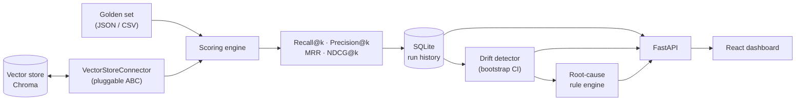

# RAG Drift Detector

**Catch retrieval quality degradation in your RAG system before your users do.**

Most RAG systems are evaluated once, at build time, and never again. Then the
corpus grows, documents get re-chunked, someone swaps the embedding model, the
index goes stale — and retrieval quality decays *silently*. Nothing errors. The
LLM keeps producing fluent answers, just with worse context behind them. By the
time anyone notices, it has been broken for weeks.

RAG Drift Detector is a small, self-hostable, open-source tool that watches one
thing well: **is retrieval still returning the documents it used to?**

It is not an LLM observability platform. There is no tracing, no token
accounting, no per-span waterfall. It scores a golden set against your vector
index on a schedule, tracks the metrics over time, decides *statistically*
whether a drop is a real regression or normal noise, and tells you in plain
English what most likely caused it.

---

## Status

Built in stages, each one working end to end before the next begins.

| Stage | Scope | Status |
| ----- | ------------------------------------------- | ------ |
| 1 | Golden eval set + scoring engine | ✅ Done |
| 2 | Historical tracking (SQLite) + REST API | ✅ Done |
| 3 | Statistical drift detection | ⬜ Next |
| 4 | Root-cause diagnostics rule engine | ⬜ |
| 5 | React + TypeScript dashboard | ⬜ |
| 6 | Docker packaging + full documentation | ⬜ |

---

## Architecture



The dependency direction is the point: the scoring engine depends on the
`VectorStoreConnector` abstraction and the pure metric functions, never on
Chroma. Adding Qdrant or pgvector is one new module and a registry entry — no
change to metrics, drift detection, or the API.

```
backend/
├── app/
│   ├── domain/          value objects (golden set, retrieval, metrics, history)
│   ├── connectors/      VectorStoreConnector ABC + registry + Chroma impl
│   ├── embeddings/      EmbeddingProvider ABC + registry + offline hashing impl
│   ├── db/              SQLAlchemy models, sessions, Alembic helpers
│   ├── repositories/    SQL lives here; returns domain objects, never ORM rows
│   ├── services/        business logic (scoring, golden sets, runs, bootstrap)
│   ├── api/             FastAPI app, routers, schemas, error mapping
│   ├── core/            config, logging, errors, composition root
│   └── cli.py           thin adapter over the services
└── alembic/versions/    migrations — the single source of truth for the schema
```

Layering is enforced by direction of imports: `api → services → repositories →
db`, with `domain` depended on by everything and depending on nothing. No route
handler touches a repository; no repository knows what HTTP is.

---

## Quickstart

Requires Python 3.11+.

```bash
cd backend
python -m venv .venv
. .venv/Scripts/activate      # Windows;  source .venv/bin/activate on Unix
pip install -r requirements-dev.txt

python -m app.cli seed        # index the bundled demo corpus into Chroma
python -m app.cli evaluate -v # score the golden set and record the run
python -m app.cli serve       # start the API on http://127.0.0.1:8000
```

The first database-touching command migrates the schema and imports the demo
golden set automatically, so there is no separate init step.

Output:

```
Golden set : acme-cloud-support v1 (ac6007e1dbb45cb2)
Store      : chroma/drift_demo - 32 documents
Embeddings : hashing-v1-d384
Queries    : 30   Duration: 2282 ms

  k   Recall@k   Precision@k      MRR    NDCG@k
-----------------------------------------------
  1     0.8667        0.9333   0.9333    0.9333
  3     0.9000        0.3222   0.9500    0.9433
  5     0.9333        0.2067   0.9583    0.9582 *
 10     0.9833        0.1133   0.9583    0.9622

* primary cutoff (k=5) - the one drift detection tests
```

Other commands:

```bash
python -m app.cli info                     # resolved config + index status
python -m app.cli history                  # recorded runs, newest first
python -m app.cli db status                # current vs head schema revision
python -m app.cli import-golden-set FILE   # store a JSON/CSV set in the database
python -m app.cli golden-set --check-index # validate a golden set against the index
python -m app.cli evaluate --no-save       # score without recording history
```

Everything is configurable through `DRIFT_`-prefixed environment variables (see
`backend/app/core/config.py`), e.g. `DRIFT_CHROMA_COLLECTION`,
`DRIFT_EVAL_K_VALUES=1,5,20`, `DRIFT_EVAL_PRIMARY_K=5`.

---

## REST API

`python -m app.cli serve` — interactive docs at `/docs`, OpenAPI at
`/openapi.json`.

| Method | Path | Purpose |
| ------ | ------------------------------ | ---------------------------------- |
| GET | `/api/health` | Liveness; 503 if the DB or vector store is down |
| GET | `/api/system/info` | Resolved config, schema revision, index status |
| GET | `/api/dashboard` | Everything the home screen needs, in one request |
| POST | `/api/runs` | **Run an evaluation now** |
| GET | `/api/runs` | Paginated history, newest first |
| GET | `/api/runs/latest` | Most recent run, or `null` |
| GET | `/api/runs/{id}` | One run's aggregate metrics |
| GET | `/api/runs/{id}/queries` | Per-query breakdown at the primary cutoff |
| DELETE | `/api/runs/{id}` | Delete a run |
| GET | `/api/metrics/trends?k=5` | All four metrics over time, one request |
| GET | `/api/metrics/series?metric=&k=` | One metric over time |
| GET | `/api/metrics/cutoffs` | Cutoffs that actually have data |
| GET/POST | `/api/golden-sets` | List / create |
| PUT | `/api/golden-sets/{id}` | Replace judgements |
| POST | `/api/golden-sets/{id}/activate` | Choose the set runs use by default |
| POST | `/api/golden-sets/import` | Import a JSON/CSV file |

Every error shares one envelope:

```json
{ "error": { "code": "run_not_found", "message": "run 'abc' not found" } }
```

Clients branch on `code`; `message` wording is free to change.

---

## Storing history

Runs go into SQLite through SQLAlchemy, with **Alembic** as the only source of
truth for the schema — there is no `create_all` shortcut, and the test suite
runs the real migrations for every test, so a schema nobody has proved
deployable can never pass CI.

Two schema decisions carry most of the weight:

**Golden sets are relational, not JSON blobs.** Queries and expected documents
are real rows, so the dashboard's editor can change one pair without rewriting
the set, and diagnostics can join judgements against results in SQL.

**Runs denormalise the golden set they were scored against.** Alongside the
foreign key, each run stores the golden set's name, version and *fingerprint*
as plain columns. Deleting or editing a golden set therefore cannot rewrite
history — a metric is only meaningful next to the ruler that produced it, and
that ruler must not be able to change retroactively. Editing judgements
recomputes the fingerprint, which automatically excludes runs either side of
the edit from each other's drift comparison.

Two SQLite pragmas are set explicitly on every connection: `foreign_keys=ON`
(without it, every declared `ON DELETE CASCADE` is silently inert) and
`journal_mode=WAL` (so a dashboard poll does not block on an in-progress
evaluation).

---

## The golden set

A golden set is the ground truth definition of "good retrieval" for *your*
system: queries paired with the documents that should come back for them.

JSON, with optional graded relevance:

```json
{
  "name": "acme-cloud-support",
  "version": "1",
  "queries": [
    {
      "query_id": "q-429",
      "query": "getting HTTP 429 with a Retry-After header from the api",
      "expected_documents": [
        { "document_id": "doc-api-001", "relevance": 3 },
        { "document_id": "doc-api-004", "relevance": 1 }
      ]
    }
  ]
}
```

CSV, for sets maintained in a spreadsheet — one row per (query, document) pair:

```csv
query_id,query,expected_document_id,relevance
q-429,getting HTTP 429 from the api,doc-api-001,3
q-429,getting HTTP 429 from the api,doc-api-004,1
```

Every golden set carries a **fingerprint**: a content hash of the judgements
alone, ignoring name and timestamps. Two runs are only comparable for drift
purposes if they were scored against the same fingerprint — otherwise you are
measuring a change in the ruler, not a change in the system.

---

## Metrics, and the conventions behind them

IR metrics have several defensible definitions in the wild, so this project
states which ones it uses. All four are reported in `[0, 1]` and **macro**
averaged — each query counts once regardless of how many documents it expects,
so a handful of many-document queries cannot mask a broad regression.

| Metric | Definition used here |
| ------------- | ------------------------------------------------------------ |
| Recall@k | `\|relevant ∩ top-k\| / \|relevant\|` |
| Precision@k | `\|relevant ∩ top-k\| / min(k, \|retrieved\|)` — the denominator is clamped to what was actually returned, so a store holding fewer than *k* documents is not punished for the size of its corpus |
| MRR | mean of `1 / rank` of the *first* relevant hit within top-k; `0` on a miss |
| NDCG@k | exponential gain `2^rel − 1`, `log2(rank + 1)` discount, normalised by the ideal ranking of that query's own judgements — honours graded relevance |

Metrics for *every* configured cutoff come from a **single** retrieval at
`max(k_values)`. Retrieval is the expensive step, and deriving Recall@1/@3/@5/@10
from one ranked list is both cheaper and more internally consistent than issuing
four queries whose results could differ.

Why track all four? Recall is blind to ordering: a change that pushes the right
document from rank 1 to rank 5 leaves Recall@5 untouched while NDCG and MRR both
drop. That is precisely the kind of silent degradation this tool exists to catch.

---

## Embeddings, and why they are explicit

The Chroma connector embeds queries itself through an `EmbeddingProvider` rather
than delegating to Chroma's built-in embedding function. Two reasons:

1. **Silently swapping embedding models is one of the most common real causes of
   retrieval drift.** Making the provider explicit means every run records a
   `model_id`, and the collection records the model that *built* it — so a
   mismatch between them is detectable rather than invisible (Stage 4).
2. **The demo has to run with zero setup.** The default `hashing` provider is a
   deterministic, dependency-free implementation of the hashing trick (signed
   feature hashing over word unigrams, word bigrams and character trigrams;
   sub-linear term weighting; L2 normalised). It is not a semantic model — it is
   an honest, reproducible, offline stand-in so the whole pipeline is runnable
   and testable without downloading anything.

Production deployments register a real provider under a different name; the
recorded `model_id` makes the swap visible.

---

## Development

```bash
cd backend
python -m pytest              # 163 tests
python -m ruff check app tests
python -m mypy app            # strict mode, clean
```

Test coverage concentrates where it matters for correctness: the metric
primitives are pinned to hand-computed values, and the scoring engine is
exercised through a fake connector, so the whole suite runs in seconds without a
vector store.

---

## Licence

MIT.
